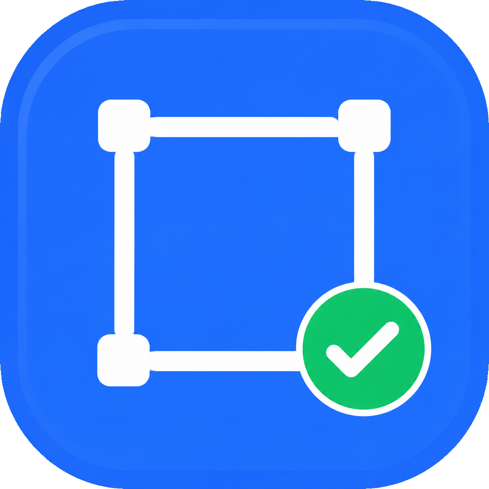

# NiceShot

<p align="center">
  
</p>

<p align="center">轻量 Windows 截图工具：窗口选中、像素级框选、OCR 与中英互译。</p>

用 conda 环境（Python 3.10）运行，托盘常驻，默认快捷键 `Ctrl+Shift+A`。

## 功能

- 自定义截图快捷键（托盘里按组合键录制）
- 一键禁用 / 启用截图：默认 `F8`，可改成单键或组合键
- 开机自动启动（无黑框）
- 悬停高亮窗口，单击选中整个窗口；按住左键拖拽框选
- 光标旁放大器：像素网格、坐标、颜色编号；`Shift` 切换 `#RRGGBB` / `R,G,B`，`Ctrl+C` 复制当前编号
- 框选后底部工具条最左侧是矩形 / 圆形图形按钮，悬停可看说明；颜色和粗细在按钮下方第二排
- 画完矩形或圆形后：拖白色角点改大小，拖彩色边框可整体移动；`Ctrl+Z` /「撤销」去掉上一笔，`Ctrl+Y` /「前进」恢复
- 滚动截图：在窗口内滚动（或点自动滚动），把多屏画面拼成一张长 PNG。算法说明见 [滚动截图算法](docs/scroll-capture.md)
- 确认后复制到剪贴板（图片 + 文件），可粘贴到任意文件夹得到 PNG
- 任意位置右键或 `Esc` 取消
- 识别框选范围内的中英文
- 智能翻译：中文 → 英文，英文 → 中文（MyMemory，无需 API Key）

## 环境

- Windows 10 / 11
- conda 环境（Python 3.10）
- 依赖见 [requirements.txt](requirements.txt)

```powershell
conda activate 你的环境
pip install -r requirements.txt
```

## 启动

在项目根目录执行：

```powershell
conda activate 你的环境
python main.py
```

启动后出现在系统托盘。图标使用 [app/assets/icon.png](app/assets/icon.png)（托盘 / 窗口 / 开机快捷方式同步使用 [app/assets/icon.ico](app/assets/icon.ico)）。

托盘菜单：

- **开始截图**（也可双击托盘图标）
- **设置截图快捷键**
- **设置禁用快捷键**（单键如 `F8`，或组合键）
- **禁用截图**
- **开机启动**
- **退出**

配置保存在 `%APPDATA%\NiceShot\config.json`。

## 截图操作

1. 按下快捷键进入全屏遮罩
2. 鼠标悬停会高亮当前窗口，单击即选中该窗口
3. 按住左键拖拽则自由框选；放大器用于像素级对齐。`Shift` 切换颜色编号格式，`Ctrl+C` 复制当前像素颜色。选中后可拖四边和四角继续改尺寸
4. 选区右下角点绿色勾，截图进入剪贴板
5. 在资源管理器中 `Ctrl+V` 可直接保存为 `NiceShot_日期时间.png`
6. 点「识别文字」或「翻译」会弹出结果窗口，可一键复制文本
7. 点「滚动截图」后周围仍保留遮罩，中间挖空显示当前截取范围。向上或向下滚动时，只拼接超出已记录顶/底边界的新内容，在已覆盖范围内来回滚不会重复加长。右下角有预览，点「完成」后长图进入剪贴板。拼接原理见 [滚动截图算法](docs/scroll-capture.md)
8. 最左侧图形按钮选矩形或圆形，在选区内拖拽画框；颜色和粗细出现在这两个按钮下方。画完后拖白色角点改大小，把光标放到彩色边框上可拖动整个框或圈。点勾后标注会一起复制出去

第一次使用识别 / 翻译时会加载 OCR 模型，可能稍慢。免费翻译接口有日配额，超限时会提示。
