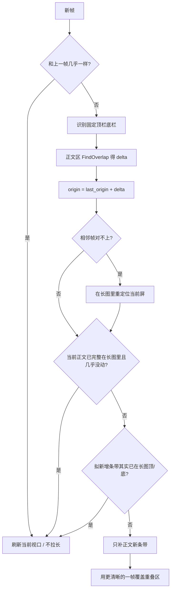

# 滚动截图算法

实现位于 [`app/scroll_capture.py`](../app/scroll_capture.py)。用户框选区域后进入滚动模式：约 **16ms** 截一帧（约 62.5 次/秒），按相邻帧重叠算出位移，再按视口坐标把**尚未覆盖**的像素接到长图上。

重叠检测的思路来自知乎文章 [桌面实时采集/实时截图：图像拼接算法实现总结](https://zhuanlan.zhihu.com/p/1906688609869869588)（CompareRow / FindOverlap / CombineImages），在此基础上补了双向滚动、坐标画布、固定栏和边界检查。

## 为什么不能首尾相接

连续两帧之间有大面积重叠。直接把新帧接到长图底下会重复一段；只拿长图顶/底去对，来回翻时又会把中间已经拍过的屏再接一次。

因此算法分两步：

1. **算位移**：这一帧相对上一帧往上还是往下、走了多少像素
2. **按坐标补图**：视口在长图里的位置变了，但只有超出已截范围才加像素

## 坐标系

把当前选区看成一个在长图上滑动的窗口。

- `origin`：当前帧第 0 行对应长图上的 Y
- `delta > 0`：往下翻，内容上移，新内容出现在视口底部
- `delta < 0`：往上翻，新内容出现在视口顶部

第一帧整张作为长图，`origin = 0`。之后：

```
origin ← last_origin + delta
```

只有 `origin < 0`（上方还有没截过的）或 `origin + 帧高 > 长图高`（下方还有没截过的）才加长。在已截区间里来回翻，只更新 `origin`，长图高度不变。

```
长图
┌─────────────┐
│ 已截内容    │
│    ┌─────┐  │  ← origin
│    │视口 │  │
│    └─────┘  │
│             │
└─────────────┘
```

## 逐行重叠（CompareRow / FindOverlap）

桌面截图像素很难完全相等，比较时用平均色差，容差 `ROW_TOL = 10`，行内每隔 4 个像素取样。

**CompareRow**：比较两张图指定两行的内容区（避开左右边栏）。

**FindOverlap（往下）**：在上一帧（或长图尾部）里找哪一行对齐新帧第 0 行，再抽查后续若干行，确认不是碰巧一行相同（例如大片留白）。重叠高度 `h` 与位移的关系：

```
delta_down = 帧高 - h
```

**FindOverlap（往上）**：对称地比上一帧顶部和新帧底部。

分数接近时：

- 先看这两个位移哪一个更能对上长图（`_origin_fit`）
- 再听上次滚动方向
- 仍接近则取 **|delta| 更小** 的（重叠更大、更可信）

实际计算时先切掉吸顶栏/底栏，只对中间会动的正文做 FindOverlap，避免第 0 行永远对上固定导航栏、位移被算成 0。

## 一帧怎么接进长图

入口是 `stitch_vertical`，每帧按下面顺序处理。



### 1. 固定栏

`_sticky_bands` 从顶、底往中间扫：相邻两帧**同一行位置**几乎不变的，视为吸顶栏/底栏。整屏都没动则不算固定栏，交给后面的 idle / 边界逻辑。

接图时顶栏、底栏各只留一份：往下接的新条带取「底栏上方的正文」，插入到已有底栏之前。

### 2. 位移与重定位

优先用相邻两帧的正文重叠。翻太快、两帧对不上时，用当前帧中间几行在长图里搜索（`locate_frame`），探针避开顶底 inset，避免固定栏把 origin 钉在 0。

再不行，才用长图顶/底做最后一次 FindOverlap（刚翻出已截范围时）。

### 3. 边界：不要加多余画面

到页面顶/底后继续猛翻，会出现回弹、滚动条抖动、合成器差一两像素。这些**不是新内容**。

- `frames_idle`：整帧平均色差很小（光标、滚动条在闪）→ 当没滚
- `_fully_contained`：当前屏**正文**已经完整落在长图里，且 `|delta|` 很小 → 不拉长
- `_refuse_duplicate_growth`：准备接上去的正文条带已经出现在长图顶/底 → 丢掉

判断「已包含」时跳过固定栏，否则吸顶栏会对上长图顶部，误判成无法拓展。

### 4. 只补超出范围的像素

`place_frame` 按 `origin` 和固定栏高度算 `pad_top` / `pad_bot`。小于 `MIN_GROW`（3px）的增量视为噪声。

往下：`新条带 = 当前帧[底栏上方 pad_bot 行]`  
往上：`新条带 = 当前帧[顶栏下方 pad_top 行]`

### 5. 同一视口再截一次

`refresh_viewport` 把更清晰的一帧覆盖到长图对应区域（PDF 刚渲染完、模糊帧之后的稳定帧）。固定栏不写进正文。明显发糊的扩展帧会丢掉（Laplacian 清晰度低于上一帧的一半）。

## 采集循环

`ScrollCapturePanel` 用 `QTimer`（`PreciseTimer`，间隔 `TICK_MS = 16`）抓选区。

| 项目 | 值 | 含义 |
| --- | --- | --- |
| `TICK_MS` | 16 | 采集间隔，约 62.5 Hz，**不是**显示器刷新率 |
| `PREVIEW_MS` | 80 | 预览最多约 12.5 Hz，避免拖慢拼接 |
| `MIN_OVERLAP` | 12 | 两帧至少要有约 12 行对得上才认定位移 |
| `MAX_HEIGHT` | 32000 | 长图高度上限（像素） |

操作条和预览窗口设了 `WDA_EXCLUDEFROMCAPTURE`，不会进画面。自动滚动用滚轮消息；连续多帧几乎不变则提示已到边界。

## 和「只往下拼」的差别

原文 CombineImages 是：

```
新高度 = 长图高 + (新帧高 - 重叠)
把新帧画在 (0, 长图高 - 重叠)
```

这在单向往下滚时正确。NiceShot 还要：

- 往上翻：对称接在顶部
- 来回翻：用 `origin` 记住视口，已覆盖区间不再加长
- 快翻：相邻帧对不上就到长图里重定位
- 到顶/到底：严格检查，避免回弹多接一段
- 吸顶栏/底栏：不参与重叠，接图时各留一份

## 关键函数

| 函数 | 作用 |
| --- | --- |
| `compare_row` | 比较两图指定行 |
| `find_overlap_down` / `find_overlap_up` | 搜重叠高度 |
| `_sticky_bands` | 认出不动的顶/底栏 |
| `find_signed_delta` | 正文区重叠 → 有符号位移 |
| `locate_frame` | 当前屏在长图中的 Y |
| `_fully_contained` | 正文是否已在长图内 |
| `_refuse_duplicate_growth` | 拒绝把已有条带再接一次 |
| `place_frame` | 按坐标只补新正文 |
| `refresh_viewport` | 同屏更新（加载完成 / 更清晰） |
| `stitch_vertical` | 上面各步的入口 |

## 已知边界

- 两帧重叠少于约 12 行（一屏几乎翻没）时，可能对不上，这一帧会跳过或靠长图重定位
- 正文里大段重复图案（相同列表行、纯色）可能产生多个候选重叠，靠分数和 `|delta|` 较小者消歧
- 采集间隔是程序截屏频率；到边界多接画面通常不是「刷新率不够」，而是把回弹当成了新位移（已用边界检查抑制）
